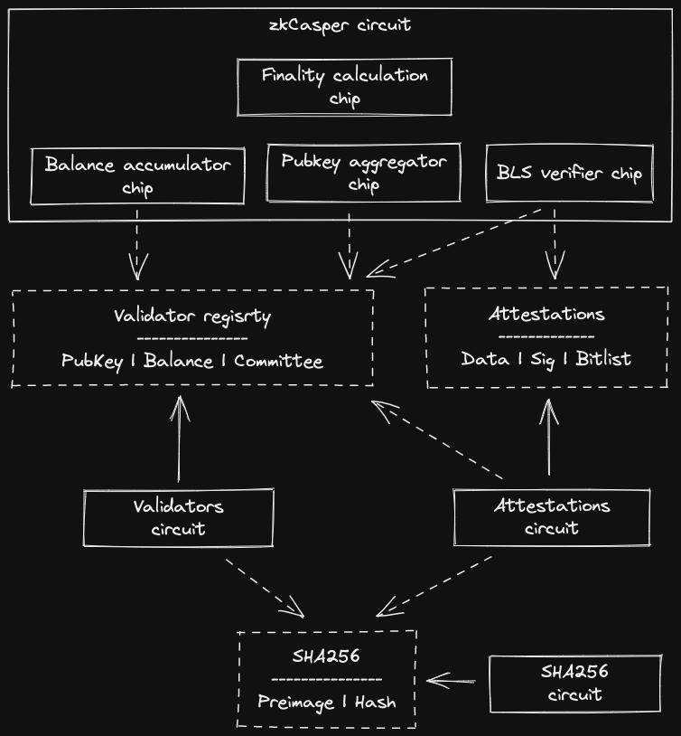

# ZK-CASPER Architecture

In the proposed architecture, multiple sub-circuits are placed within a super-circuit. When a circuit encounters an expensive operation, it can outsource the verification effort to another circuit. The main `zkCasper` circuit would use lookup tables via lookup arguments in a simple input-output relationship, outsourcing the effort of verifying the relationship itself to the sub-circuit proofs.

Traditional lookup arguments can only access tables containing public values that both verifier and prover knows and are fixed during circuit compilation. In `halo2-ce` fork this limitation was removed (see [PR](https://github.com/privacy-scaling-explorations/halo2/pull/8)) allowing lookups to private `Advice` columns.

## Diagram

